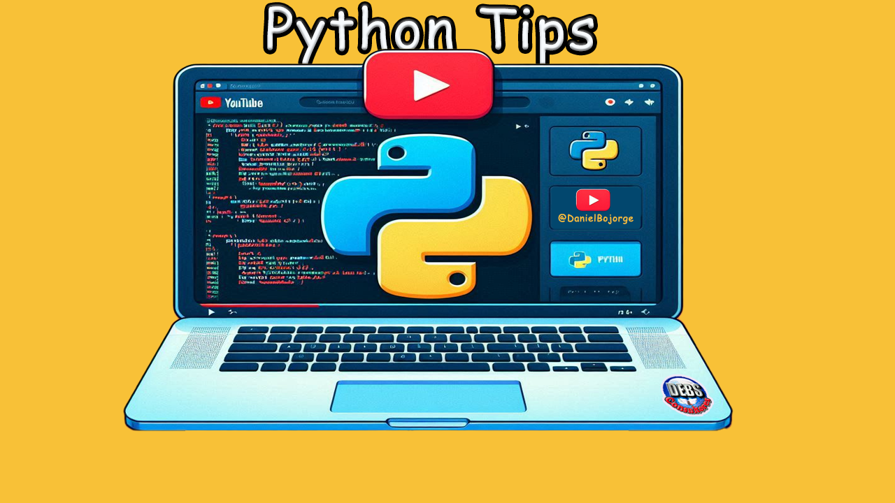

# 🐍Python Tips 📜 DEBSConsultores 📽 Youtube/@DanielBojorge

## Descripción
Bienvenido al repositorio de **Python Tips**. Aquí encontrarás scripts y consejos útiles para mejorar tus habilidades en Python.

## Enlaces
- **GitLab**: [Enlace al repositorio en GitLab](https://gitlab.com/debsdaniel/python_tips.git)
- **GitHub**: [Enlace al repositorio en GitHub](https://github.com/debsconsultores/python_tips.git)
- **YouTube**: [Canal de YouTube @DanielBojorge](http://youtube.com/@DanielBojorge)
- **Lista de Reels**: [Enlace a la lista de Reels](https://www.youtube.com/playlist?list=PL4TpT7opAQlIgCC5ibGWvqKrUxuUQXC-g)

## Cursos en Udemy
Para más contenido y cursos detallados, visita mis cursos en Udemy:
- [Enlace a mis cursos en Udemy](https://bit.ly/udemy-cursos-daniel-bojorge-mejor-precio)

Encuentra más recursos y aprende a desplegar aplicaciones Django, optimizar tu código Python y mucho más.

## Imagen de Fondo

---

¡Gracias por visitar el repositorio! No olvides suscribirte al canal de YouTube y seguirme en las redes sociales para más actualizaciones.
